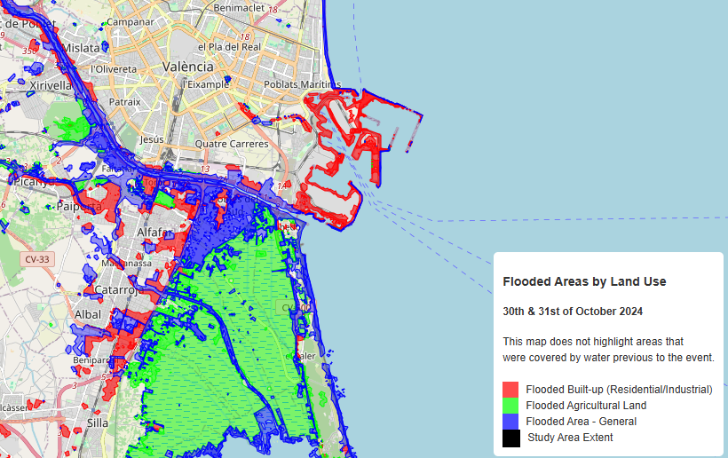

# Flood Map of Valencia - October 2024

**[View the hosted map on GitHub Pages](https://simon-donike.github.io/VLC_flood_map/)**

## Overview
This repository contains a visual map of the flood extent in Valencia, Spain, using satellite imagery data captured on **October 30, 2024**. The flood event itself occurred on **October 29, 2024**, and this map represents the areas that were still affected by standing or flowing water on the following day.

## Flood Model
The detection model is ML4Floods (https://spaceml-org.github.io/ml4floods/content/config.html), being used on Sentinel-2 imagery from the 31st of October. The resuts are joined with the detections from an LANDSAT-8 image from the 30th of october.

## Data Description
The flood extent shown in this map was derived from a machine learning flood detection model applied to satellite imagery. The detection jointly calculated for a LANDSAT-8 image of the 30th in conjunction with the detections based on the S2 image from the 31st. It is possible that some affected areas, especially urban zones, are not detected due to the input resolutions and the difficulty of detection flood damage for regions where the water has retreated already.

### Layers Included
- **Total Flooded Area**: General areas detected as flooded.
- **Flooded Built-up Zones**: Residential and industrial zones affected by flooding.
- **Flooded Agricultural Land**: Agricultural areas impacted by the flood.
- **Cloud Cover**: Regions obscured by clouds at the time of image acquisition, marked as invalid for flood detection.
- **Study Area Extent**: Bounding box outlining the extent of the study area.

### Disclaimer
This map is based on satellite data and has not been validated on the ground. It is intended for informational purposes only and should not be used for navigation or critical decision-making.

## Usage
To view the map, open the `index.html` file in a web browser. Ensure that all GeoJSON data files are located in a `data/` directory within the root of the project to allow the map layers to load correctly.

## Acknowledgments
The flood detection model and satellite imagery used in this project were developed for the purpose of monitoring and assessing flood impacts in the Valencia region.
